  <picture>
    <source media="(max-width: 760px) and (prefers-color-scheme: dark)" srcset="./assets/hero/builder-profile-v2-mobile-dark.svg">
    <source media="(max-width: 760px)" srcset="./assets/hero/builder-profile-v2-mobile-light.svg">
    <source media="(prefers-color-scheme: dark)" srcset="./assets/hero/builder-profile-v2-dark.svg">
    <source media="(prefers-color-scheme: light)" srcset="./assets/hero/builder-profile-v2-light.svg">
    
  </picture>

<!-- 

  <a href="https://wildan-portfolio-six.vercel.app"><strong>View Portfolio</strong></a>

 -->

## Hey, I'm Naja

I'm a **full-stack builder** based in Malang, Indonesia. I work across **AI agents, and developer tools**, shaping products, leading teams, and building the software behind them.

I enjoy taking projects from an early idea to a working release: defining the product, building the core system, testing the final flow, and often coordinating the team along the way.

## What I Build

- **Product & full-stack engineering:** from product direction and interface design to backend systems, integrations, deployment, and QA.
- **AI products:** tool-using agents, purpose-built interfaces, and workflows that keep people in control.
- **Developer tools:** testing, reliability, and AI-assisted engineering workflows.

## Selected Work

| Project | What I built | My role · Current state |

## Selected Highlights

## What I'm Exploring

I'm interested in AI agents that can work with real tools, software, and financial systems, not only generate text.

Research helps me understand the deeper questions. Building prototypes and products is how I test those ideas in practice.

## Tools I Use

`TypeScript` · `Next.js` · `React` · `Node.js` · `Python` · `Rust` · `Motoko` · `PostgreSQL` · `Playwright` · `Stellar` · `Internet Computer`

## Contribution Trail

  <picture>
    <source media="(prefers-color-scheme: dark)" srcset="https://raw.githubusercontent.com/Sithm4n/Sithm4n/output/github-contribution-grid-snake-dark.svg">
    <source media="(prefers-color-scheme: light)" srcset="https://raw.githubusercontent.com/Sithm4n/Sithm4n/output/github-contribution-grid-snake.svg">
    
  </picture>

<strong>Recent public activity</strong>

 

<!-- AUTO:ACTIVITY:START -->

<!-- AUTO:ACTIVITY:END -->

---

  Building useful products around AI, Web3, and developer tools.

